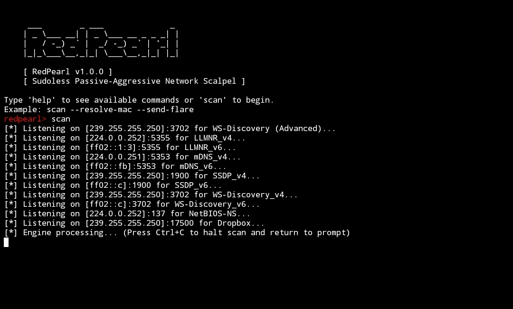
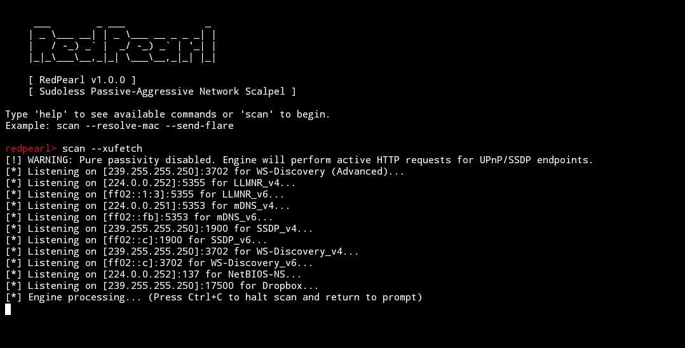

# RedPearl
**version:** 1.0.0

## The Passive-Aggressive Dual-Stack Network Scalpel

 RedPearl is an advanced, asynchronous network discovery and telemetry tool. Designed to operate primarily as a passive listener, it maps complex dual-stack (IPv4/IPv6) networks by analyzing multicast and broadcast traffic (mDNS, NetBIOS, LLMNR, SSDP, WS-Discovery). When operational parameters permit, RedPearl transitions into an "active-aggressive" state, deploying mathematically paced micro-engagements, unprivileged sweeps, and egress audits to validate network boundaries and extract high-value asset telemetry without triggering standard Intrusion Detection Systems (IDS). I built it as a tool to excel at the specific areas where sledgehammers like Nmap falls short, not to replace them but as a tool specifically for filling the weaknesses.
 
 **Disclaimer:** *Of course this tool is for educational purposes and authorized security testing only. Don't use this in infrastructure you don't own or don't have explicit permission to test. And I(the author) is not to be held accountable for any damage caused by this tool.*
 
 ---
 
 ### Architecture & Technical Specifications
 
 RedPearl is built on a highly modular architecture, utilizing Python's asyncio for high-concurrency network operations alongside a ThreadPoolExecutor to prevent blocking the main event loop during CPU-bound parsing or synchronous OS fallback executions.
 
 ---
 
 ### Core Specifications
 
 * **Concurrency Model:** Asynchronous Event Loop (`asyncio`) + 20-Worker Thread Pool.
 * **Dual-Stack Correlation:** Automatically merges IPv4 and IPv6 identities sharing identical MAC addresses into singular identity objects in memory.
 * **Privilege Requirements:** Designed to run seamlessly in sudoless/non-root environments, dynamically pivoting privileged ports (<1024) to ephemeral ranges when necessary.
 * **Dependency Profile:** Zero external networking libraries required for core packet crafting. Employs raw binary packing/unpacking (`struct`) for DNS, SNMP, LDAP, and NetBIOS.
 
---

### Component Subsystems

1. `RedPearl.py` (The Orchestrator):
The central nervous system of the tool. It binds all multicast sockets, manages the thread pool, and maintains the global network_map. It handles real-time state correlation, dual-stack merging, and dynamically routes discovered endpoints to respective auditing or engagement engines.

2. `wsd_engine.py` (WS-Discovery Subsystem):
Listens passively on UDP 3702 for SOAP envelopes. It extracts hardware types, UUIDs, and service URLs (XAddrs) using robust XML parsing (falling back to `defusedxml` if available to prevent XXE/Entity bombs). It can also generate rigidly normalized WS-Discovery Probes to "flare" quiet Windows targets.

3. `defensive_parser.py` (Adversarial Payload Protection)
A critical defensive mechanism that guards the scanner against malformed, truncated, or deliberately malicious packets (e.g., Honeypot tarpits).
* **Boundary Enforcement:** Wraps struct.unpack to ensure exact buffer sizing, preventing Out-Of-Bounds (OOB) reads.
* **Anti-ReDoS:** Uses a linear O(N) byte-walker to extract printable ASCII, completely eliminating Regular Expression Denial of Service vulnerabilities.
* **Pointer Loop Protection:** Actively tracks jumps during DNS-style label decompression to prevent infinite recursive pointer loops.

4. `egress_auditor.py` (Boundary Mapping)
An `asyncio`-driven module that tests outbound firewall rules by attempting connections to high-reputation external domains. It differentiates between silent packet drops (Timeout), active network rejection, and successful outbound handshakes.

5. `engagement_engine.py` (Reactive Micro-Engagements)
Fires real-time, context-aware interrogations based on passive telemetry:
* **TLS Harvesting:** Connects to ports 443, 8443, etc., pulling the raw X.509 DER certificate to extract internal Subject Alternative Names (SANs) without actually completing an HTTP request.
* **AirPlay Probing:** Simulates an ephemeral AirPlay pairing receiver to extract server profiles.

6. `rdnsse.py` (Reverse DNS Swarm Engine)
Executes unprivileged metadata harvesting using raw binary sockets:
* **CLDAP Pings:** Identifies Active Directory Domain Controllers via unprivileged UDP 389 rootDSE pings.
* **SNMPv2c:** Dynamically crafts ASN.1 BER envelopes to request `sysDescr` from port 161.
* Inverse DNS: Queries local gateways for PTR records.

7. `mdns_state.py` (Live Telemetry Tracking)
Tracks internal state transitions by parsing mDNS TXT records. It maps bitmasks for Apple AirPlay (Status/Feature flags) and Google Cast to determine if a device is "Idle," "Streaming," or "Locked."

8. `stealth_engine.py` (Evasion & Entropy)
Provides mathematically sound timing delays using continuous exponential distributions (Poisson processes) to break predictable frequency analysis signatures. It also provides dynamic, high-reputation routing targets to avoid destination-concentration IDS alerts.

9. `mac_resolver.py` & `sysprinter.py`:
* **MAC Resolver:** Provides cross-platform (Windows, Linux, macOS) cascading fallbacks to extract neighbor cache (ARP/NDP) mappings via kernel file reads, iproute2, or PowerShell.
* **Fingerprint Engine:** Uses heuristic protocol stacking and string analysis to map vendor, MAC, and protocol combinations to specific hardware types (e.g., IoT Linux, Gaming Consoles, Domain Controllers).

---

### Some of the Cool Features

 1. Temporal Awareness & Telemetry Tracking:
 Unlike static network scanners, RedPearl possesses temporal awareness. It actively tracks dynamic bitmasks embedded in mDNS TXT records (such as Apple AirPlay's sf/ff flags and Google Cast's st/ca codes) over time. This allows the engine to maintain a live state machine of the network environment, detecting when targets transition from an "Idle" state to an active "Streaming" or "Locked" state.

```python

def update_and_check_transitions(self, host_id, raw_txt):
    # Parses raw TXT dictionaries and extracts protocol-specific telemetry
    txt_dict = self.parse_txt_dict(raw_txt)
    
    # ... extraction logic ...
    
    # State Machine Transition Logic
    previous_record = self.state_registry.get(host_id)
    self.state_registry[host_id] = telemetry

    if previous_record:
        old_state = previous_record["state"]
        new_state = telemetry["state"]
        
        if old_state != new_state:
            return {
                "event": "STATE_TRANSITION",
                "host": host_id,
                "protocol": telemetry["protocol"],
                "from_state": old_state,
                "to_state": new_state,
                # ...
            }
            
```

2. Defensive DNS Pointer: ResolutionPrevents infinite recursion exploits and malformed label lengths when parsing raw DNS/mDNS traffic.
```python
def safe_resolve_dns_pointer(data: bytes, initial_offset: int, max_depth: int = 5) -> tuple:
    labels = []
    offset = initial_offset
    visited_offsets = set()
    depth = 0
    first_jump_offset = None 

    while True:
        if depth > max_depth:
            raise ParsingError("Adversarial Pointer Nesting: Maximum recursion loop depth exceeded.")
        
        length_bytes = DefensiveParser.safe_unpack("!B", data, offset)
        length = length_bytes[0]
        
        if length == 0:
            offset += 1
            break
            
        if (length & 0xC0) == 0xC0:
            depth += 1
            pointer_bytes = DefensiveParser.safe_unpack("!H", data, offset)
            pointer_target = pointer_bytes[0] & 0x3FFF 
            
            if pointer_target in visited_offsets:
                raise ParsingError("Infinite loop exploit detected.")
            
            visited_offsets.add(pointer_target)
            if first_jump_offset is None:
                first_jump_offset = offset + 2
                
            offset = pointer_target
            continue
```

3. Poisson Entropy Pacing:
Uses an exponential variate to generate continuous, unpredictable scanning delays.
```python
def get_poisson_delay(self, target_average: float, min_floor: float = 0.08) -> float:
    if target_average <= min_floor:
        return min_floor
    
    # Lambda (rate parameter) is 1 / mean
    lambd = 1.0 / (target_average - min_floor)
    jittered_delay = random.expovariate(lambd) + min_floor
    
    # Hard cap to ensure the scan doesn't hang indefinitely on statistical outliers
    return min(jittered_delay, target_average * 3.5)
```

4. Dual-Stack Object Unification:
Correlates distinct IPv4 and IPv6 packets back to a single physical asset via memory referencing.
```python
 def _correlate_dual_stack(self):
    mac_groups = {}
    for ip, data in list(self.network_map.items()):
        mac = data.get("MAC")
        if mac and mac != "Unknown MAC":
            mac_groups.setdefault(mac, []).append((ip, data))
    
    for mac, entries in mac_groups.items():
        if len(entries) < 2: continue
                
        # [ ... Logic isolating IPv4 and IPv6 candidates ... ]
        
        if ipv4_candidate and ipv6_candidate:
            ip4, d4 = ipv4_candidate
            ip6, d6 = ipv6_candidate
                    
            if d4 is not d6:
                unified = {
                    "IPv4": ip4,
                    "IPv6": ip6,
                    "MAC": mac,
                    "Vendor": d4.get("Vendor") if d4.get("Vendor") != "Unknown Vendor" else d6.get("Vendor"),
                    "Protocols": d4.get("Protocols", set()).union(d6.get("Protocols", set())),
                    "Queries": d4.get("Queries", 0) + d6.get("Queries", 0),
                    "Attributes": d4.get("Attributes", {}).copy()
                }
                        
                # Re-route map references to point to the exact same object in memory
                self.network_map[ip4] = unified
                self.network_map[ip6] = unified
```
5. "Sudoless" Operation via Ephemeral Pivoting:
Binding to ports below 1024 usually requires root/administrator privileges. To remain "sudoless", if RedPearl detects it is running without root on Linux/macOS, it instructs the OS to bind to dynamic, ephemeral ports (ports > 1024). It can still receive broadcast traffic and even send out active UDP queries from these unprivileged ports.
```python
def _setup_multicast_socket(self, proto_name, mcast_grp, mcast_port):
    # PIVOT FOR SUDOLESS PRIVILEGED PORTS
    if platform.system().lower() != "windows" and mcast_port < 1024:
        if os.getuid() != 0:
            mcast_port = 0  # Kernel dynamically assigns an unprivileged port (>1024)
            is_ephemeral = True
    # ... sets up socket binding and multicast group joining ...
```

6. Defensive Parsing (Anti-Honeypot Mechanics):
To prevent the tool from crashing or being exploited by malicious network nodes (like honeypots sending malformed packets), RedPearl includes a hardened parsing engine. It prevents Out-Of-Bounds (OOB) memory reads, blocks infinite DNS pointer loops, and replaces ReDoS-vulnerable regular expressions with linear byte-walking. It also uses `defusedxml` to prevent XML entity bombs (XXE) when parsing SOAP/UPnP data.

7. Advanced Device Fingerprinting:
Rather than relying on active nmap-style port scanning, RedPearl identifies Operating Systems and Device types (Apple, Windows, IoT, Printers, Gaming consoles) using "Protocol Stacking" and identity strings. It looks at the combination of protocols a device speaks, its MAC vendor, and internal broadcast strings to calculate a confidence score for its identity.
```python
def identify(cls, data):
    # Rule 1: Protocol Stacking 
    # Rule 2: Identity String Matching
    # Rule 3: Vendor Matching
    for category, rules in cls.SIGNATURES.items():
        if any(s in identity for s in rules["strings"]):
            scores[category] += 5
    best_fit = max(scores, key=scores.get)
    return best_fit
```

8. Egress & Boundary Auditing: RedPearl can test a network's outbound firewall rules. It asynchronously attempts to establish TCP handshakes on common ports (22, 53, 443, 3389, etc.) to a public target. It differentiates between ports that are explicitly blocked by a firewall (Timeout) versus ports that are allowed out but refused by the remote server (Connection Refused/TCP RST).
```python
async def test_port(self, port: int, destination: str, semaphore: asyncio.Semaphore):
    try:
        coro = asyncio.open_connection(destination, port) 
        reader, writer = await asyncio.wait_for(coro, timeout=self.timeout)
        # Port is open and allowed
    except ConnectionRefusedError:
        # CRITICAL: The firewall allowed the packet out, but the target refused it.
        result.update({"status": "Closed but Allowed", "egress_allowed": True})
```

9. Reactive Engagement Engine:
If pure passivity is disabled, RedPearl acts as a "hunter." When the passive listener discovers a specific vulnerability or interesting service (like a WS-Discovery SOAP endpoint, an AirPlay stream, or a TLS port), it dispatches asynchronous "micro-engagements" to interact with it safely. For example, it will connect to a TLS port just to rip the X.509 certificate and extract internal SANs/Hostnames.
```python
async def _engage_tls_harvesting_async(self, target_ip, port):
    # Connects to a TLS endpoint, conducts the handshake, and extracts the raw X.509
    # certificate bytes to parse Common Names (CN) and SANs without validating the chain.
    ssl_sock = writer.get_extra_info('ssl_object')
    der_cert = ssl_sock.getpeercert(binary_form=True)
    self._parse_raw_x509(target_ip, port, der_cert)
```

10. Enterprise Swarm Intel (AD, SNMP, rDNS):
A dedicated module aimed at enterprise networks. Once a device is discovered passively, this engine can dispatch:
* **Inverse DNS (PTR) Swarms:** Look up hostnames via the local gateway.
* **Unprivileged CLDAP Pings:** Identifies Active Directory Domain Controllers and extracts Forest/Site topology.
* **SNMPv2c GET Requests:** Extracts raw hardware profiles (sysDescr) using standard community strings ("public", "private").
```python
def query_cldap(self, target_ip: str, timeout: float = 1.5) -> dict:
    # Transmits an unprivileged CLDAP (UDP 389) rootDSE ping to identify 
    # Active Directory Domain Controllers and extract forest/site topology.
    cldap_payload = bytes.fromhex("3084...") # ASN.1 BER Encoded LDAP SearchRequest
    sock.sendto(cldap_payload, (target_ip, 389))
```

11. mDNS Live State Tracking:
Tracks real-time behavioral state changes for smart devices (like Apple TVs, HomePods, and Google Casts). By parsing the bitmasks in mDNS TXT records, it can tell an operator if an Apple TV is "Idle", "Locked", or currently "Streaming Audio/Video".
```python
def extract_apple_airplay(self, txt_data):
    # Bitmask breakdown for Apple Status Flags (sf)
    telemetry["flags"]["password_required"] = bool(sf & (1 << 2))
    telemetry["flags"]["system_audio_streaming"] = bool(sf & (1 << 9))
    
    if telemetry["flags"]["system_audio_streaming"]:
        telemetry["state"] = "Streaming Audio/Video"
```

12. Cross-Platform OS Neighbor Cache Resolution:
Because RedPearl operates "sudoless", it cannot craft raw ARP packets to find MAC addresses. Instead, it queries the local host's OS kernel (Windows, Linux, macOS) utilizing fallback chains (e.g., `ip neigh`, `/proc/net/arp`, `Get-NetNeighbor`, `arp -a`) to pull the cached MAC addresses for discovered.
```python
 @classmethod
def _get_windows_ipv4(cls):
    # Fallback 1: Standard ARP utility
    # Fallback 2: PowerShell Get-NetNeighbor (Handles newer Windows environments)
    cmd = "powershell -NoProfile -Command \"Get-NetNeighbor -AddressFamily IPv4 | Select-Object IPAddress, LinkLayerAddress\""
    out = subprocess.check_output(cmd, shell=True, stderr=subprocess.DEVNULL).decode()
```

---

### Installation & Usage
#### Prerequisites
* Python 3.8+
* (Optional but recommended) `defusedxml` for hardened SOAP parsing. Install via `pip install defusedxml`.

#### Install it by:
##### Cloning the repo:
* Codeberg:
```bash
git clone https://codeberg.org/nulsie/redpearl.git
cd redpearl
```
* GitHub:
```bash
git clone https://github.com/nulsie/redpearl.git
```

##### Through pip:
```bash
pip install redpearl
```

#### Usage 
##### Launch it by:
* If you're cloning
```bash
python RedPearl.py
```
* If via pip:
```bash
redpearl
```

##### Console Commands
Within the `redpearl>` prompt, you can execute the `scan` command with various arguments to modify the engine's behavior:
* Standard Passive Run:
```bash
scan --interface eth0
```
* Active Kickstart & Egress Mapping:
```bash
scan --send-flare --resolve-mac --egraud
```
* Enterprise AD Profiling (Reverse Swarm):
```bash
scan --reverse-swarm --resolver 192.168.1.1
```


*A default scan*

*A scan with additional flags*

##### Argument Flags
 | Argument | Description |
| --- | --- |
| `--interface <IP/Name>` | Binds multicasts to a specific local interface (e.g., `0.0.0.0` or `eth0`). |
| `--xufetch` | Break pure passivity to fetch active UPnP HTTP descriptions. |
| `--resolve-mac` | Force neighbor table generation via asynchronous discovery bursts. |
| `--aess AESS` | External engine profile definitions path. |
| `--send-flare` | Transmit a non-aggressive, multi-stack mDNS service enumeration query to |
| `--send-wsd-flare` | Transmit an active WS-Discovery Probe query to flush out stealthy Windows targets. |
| `--debug` | Output stream allocation errors to standard error stream. |
| `--reverse-swarm` | Launch unprivileged inverse DNS PTR query swarms against discovered assets. |
| `--resolver RESOLVER` | Target IP of local gateway or primary DNS server to query for dynamic DHCP records. |
| `--egraud` | Launch the async outbound firewall egress path security auditor. |
| `--egraud-target EGRAUD_TARGET` | External public destination IP used for egress mapping. |
| `--egraud-ports EGRAUD_PORTS` | Comma-separated custom TCP ports to validate (e.g., 22,53,443,9001). |

-----

**Author:** nulsie
**License:** GNU GPL v3
